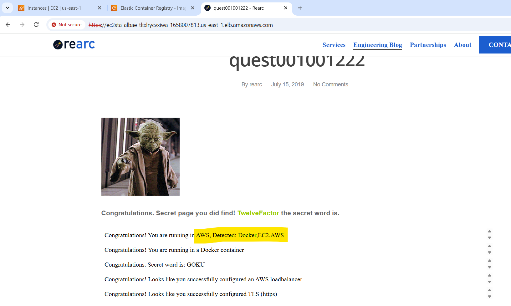
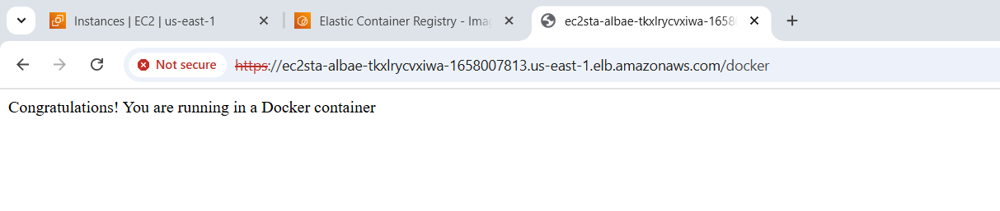
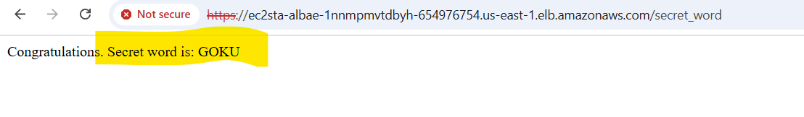
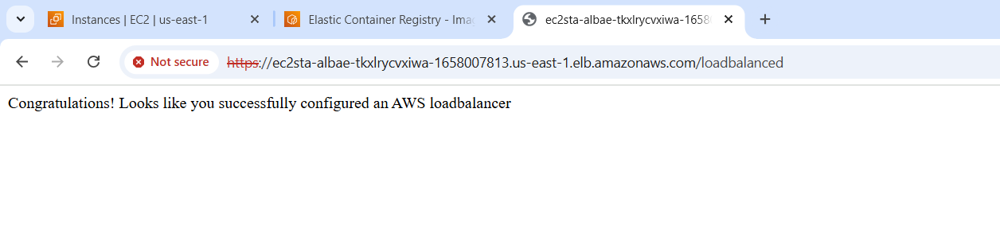
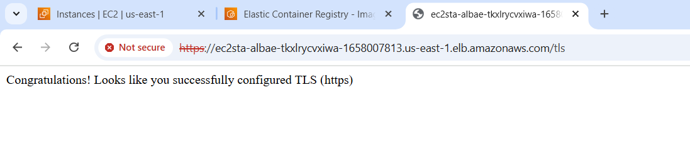
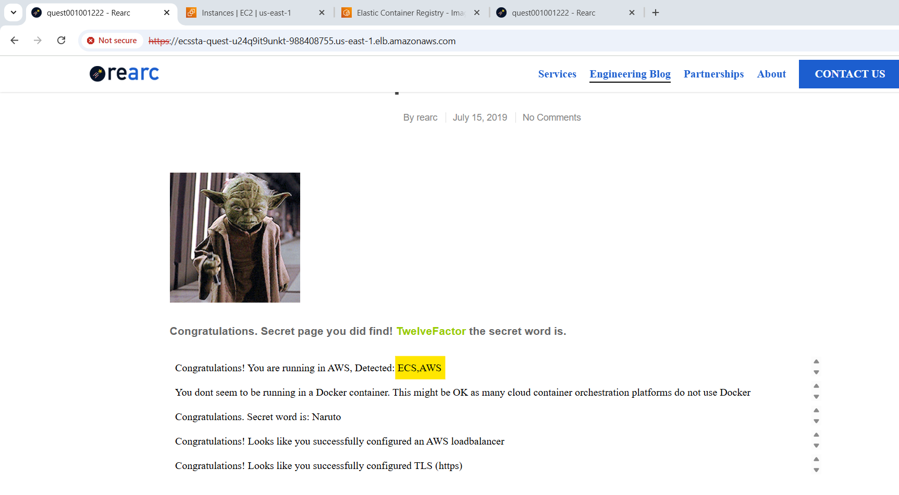
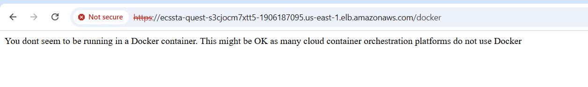
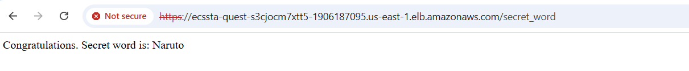
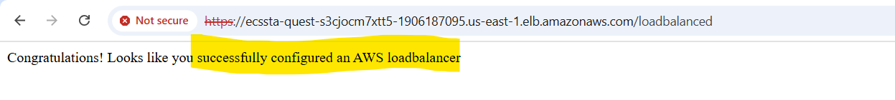
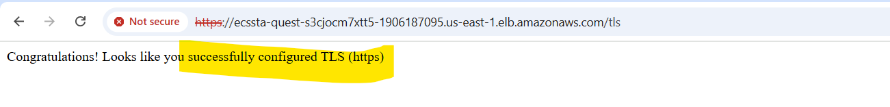

# Quest API


### `Problem Statement`

- Deploy an application on AWS exposing user facing endpoints with conditions [Quest Readme](./app/README.md)

---


### API Endpoints EC2 

1. [`Index`](https://ec2sta-albae-tkxlrycvxiwa-1658007813.us-east-1.elb.amazonaws.com/) [](https://ec2sta-albae-tkxlrycvxiwa-1658007813.us-east-1.elb.amazonaws.com/)
2. [`Docker check`](https://ec2sta-albae-tkxlrycvxiwa-1658007813.us-east-1.elb.amazonaws.com/docker) [](https://ec2sta-albae-tkxlrycvxiwa-1658007813.us-east-1.elb.amazonaws.com/docker)
3. [`Secret Word check`](https://ec2sta-albae-tkxlrycvxiwa-1658007813.us-east-1.elb.amazonaws.com/secret_word) [](https://ec2sta-albae-tkxlrycvxiwa-1658007813.us-east-1.elb.amazonaws.com/secret_word)
4. [`Load Balancer check`](https://ec2sta-albae-tkxlrycvxiwa-1658007813.us-east-1.elb.amazonaws.com/loadbalanced) [](https://ec2sta-albae-tkxlrycvxiwa-1658007813.us-east-1.elb.amazonaws.com/loadbalanced)
5. [`TLS check`](https://ec2sta-albae-tkxlrycvxiwa-1658007813.us-east-1.elb.amazonaws.com/tls) [](https://ec2sta-albae-tkxlrycvxiwa-1658007813.us-east-1.elb.amazonaws.com/tls)

### API Endpoints ECS

1. [`Index`](https://ecssta-quest-u24q9it9unkt-988408755.us-east-1.elb.amazonaws.com/) [](https://ecssta-quest-u24q9it9unkt-988408755.us-east-1.elb.amazonaws.com/)
2. [`Docker check`](https://ecssta-quest-u24q9it9unkt-988408755.us-east-1.elb.amazonaws.com/docker) [](https://ecssta-quest-u24q9it9unkt-988408755.us-east-1.elb.amazonaws.com/docker)
3. [`Secret Word check`](https://ecssta-quest-u24q9it9unkt-988408755.us-east-1.elb.amazonaws.com/secret_word) [](https://ecssta-quest-u24q9it9unkt-988408755.us-east-1.elb.amazonaws.com/secret_word)
4. [`Load Balancer check`](https://ecssta-quest-u24q9it9unkt-988408755.us-east-1.elb.amazonaws.com/loadbalanced) [](https://ecssta-quest-u24q9it9unkt-988408755.us-east-1.elb.amazonaws.com/loadbalanced)
5. [`TLS check`](https://ecssta-quest-u24q9it9unkt-988408755.us-east-1.elb.amazonaws.com/tls) [](https://ecssta-quest-u24q9it9unkt-988408755.us-east-1.elb.amazonaws.com/tls)

---

##  How to Deploy
```
1. Create EC2 stack
2. Test your stack using localstack before AWS deployment 
3. Local Stack Community does not support ECR, ApiGateway
    a. Uncomment VPC creation in lib/shared-vps.ts
    b. Uncomment get Image line 28 in lib/ecs-stack/ts 
    c. Uncomment get Image line 52 in lib/ec2-stack/ts 
3. If localstack goes to success, your AWS resoruces will deploy without failure
4. Revert back the commented parts and proceed with AWS deployment
```

```bash
chmod +x localstack.sh
```
```bash
./localstack.sh 
```

```bash
cdk bootstrap
```

```bash
cdk deploy --all
```

### What would I have If I had more time

```

1. -----------Move from EC2 to ECS with---------------------------
   The current solution works on EC2.  
   I have also added ECS as it is bit more AWS managed then EC2 and great for containerization.  
   This basic ECS example can be extended for Prod workloads.

2. -----------Enhanced IAM policies------------------------------ 
   I would implement more granular IAM roles and policies 
   Strengthening the security of the application

3. -----------Private service exposure--------------------------- 
   Currently ALB exposes it to outer world through Public Subnets
   Would be better if we make the entire serivce in Private Subnet 
   Exposed thorugh VPCE and API Gateway

4. -----------CloudWatch Logs with retention policies-----------
   Setting up CloudWatch Logs with defined retention policies  
   As financial instutions ususlaly have Regulatroy bodies asking for data/logs years older from compliance perspective

5. -----------Alerting------------------------------------------
   CloudWatch would also let me setup metric exposure of my services 
   It easily integrates with SNS for alerting in case of failures
   Further these metrics can help in proactively solves the issues before they are escalated

6. -----------Autoscaling----------------------------------------
   There could be spikes on Month/Quarter ends in financial Instituions when multilpe reports need to be sent
   Or in Retial during Sales etc, such days require auto scaling options to adjust infra according to needs

7. -----------SDLC integration-----------------------------------  
   I deployed the code via my Local Intellij 
   Having a proper functional git CI/CD pipeline would seemlessly help in deploying 
   Making deployments reliable, trackable and rollback possible 

8. -----------API throttling with authentication-----------------  
   Users can hit the API making the service suspectible to irregualar loads 
   API throttling coupled with Authentication JWT type or something that lets you find the identity of user
   And restrict the API calls will help in reducing unncessary cost 

9. -----------Architecture diagram-------------------------------  
   Adding a clear architecure diagram is something I would have done.

```

### Optional Improvements to Quest
```
1. Task 004-006 just rely on headers so these can be easily exploited
2. There should be a task to test out the IAM since it is one of the important aspect of Cloud Computing
3. The code should be buggy at some places that user has to find and fix would make it more interesting
4. There should be a architecture diagram expected to be submitted with this code
```